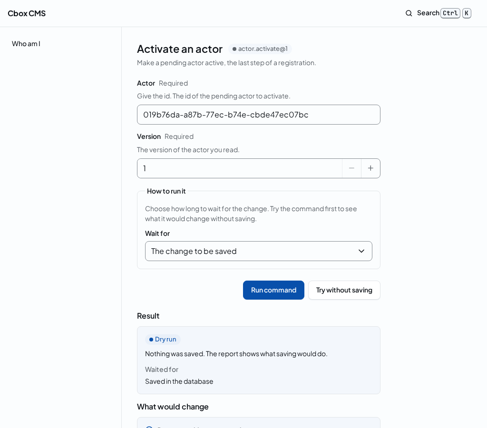
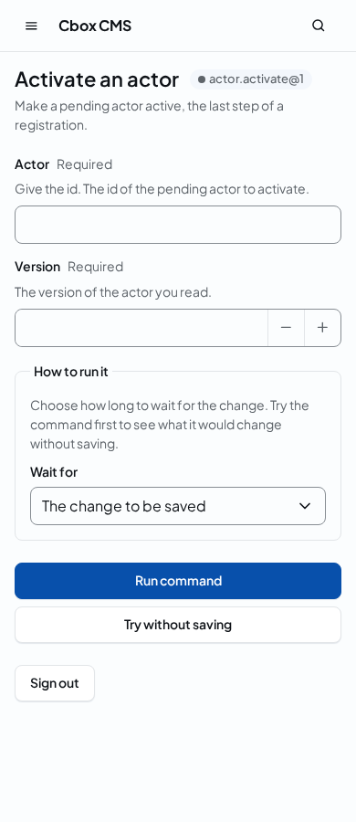

# Command form

<!-- extension-point: Cbox\Cms\Panel\CommandForm\Domain\Dto\CommandFormContextV1 -->
<!-- extension-point: packages/panel/resources/schemas/points/command.form.aside.v1.json -->
<!-- extension-point: Cbox\Cms\Panel\CommandForm\Domain\Dto\CommandFormChecksV1 -->
<!-- extension-point: packages/panel/resources/schemas/points/command.form.checks.v1.json -->
<!-- extension-point: Cbox\Cms\Panel\CommandForm\Domain\Dto\CommandFormStepsV1 -->
<!-- extension-point: packages/panel/resources/schemas/points/command.form.steps.v1.json -->
<!-- extension-point: Cbox\Cms\Panel\CommandForm\Domain\Dto\CommandFormSubmitV1 -->
<!-- extension-point: packages/panel/resources/schemas/points/command.form.submit.v1.json -->
<!-- extension-point: Cbox\Cms\Panel\CommandForm\Domain\Dto\CommandFormReceiptV1 -->
<!-- extension-point: packages/panel/resources/schemas/points/command.form.receipt.v1.json -->
<!-- extension-point: Cbox\Cms\Panel\CommandForm\Domain\Dto\FieldInputPropsV1 -->
<!-- extension-point: packages/panel/resources/schemas/points/command.form.field.v1.json -->
<!-- extension-point: Cbox\Cms\Panel\CommandForm\Domain\Dto\DryRunViewV1 -->
<!-- extension-point: packages/panel/resources/schemas/points/command.form.dryrun.v1.json -->

Every command the [command palette](command-palette.md) offers can be run with the keyboard (GUARDRAILS 8, PRD 6.1): choosing one opens its form at `GET <prefix>/commands/<name>/v<version>`, the address the Inertia profile runs the command at, and the panel renders the form from the command's JSON Schema. There is one form for every command, kernel or addon, and it names no command: the page's props carry the command's name, its contract version and its schema ([page props](../developers/panel.md#page-props)), and the kit's `SchemaForm` renders a field per member of the command's document ([the component kit](../ui/components.md)). A command the profile does not expose, another version of one or one whose document no codec reads has no form: the panel answers the page for a path it does not have.





## What the form renders

`readCommandSchema()` reads the subset of JSON Schema draft 2020-12 the kernel's command schemas use, the keywords the kernel's generated codecs have a form for ([command JSON](command-json.md)):

| In the schema | In the form |
|---|---|
| an object with `additionalProperties: false`, `properties` and `required` | the fields, in the schema's order; a nested object is a fieldset |
| a string with `pattern`, `minLength`, `maxLength` and `examples` | a text field, with the first example as its hint; a string with `format: "date-time"` takes RFC 3339 with an offset |
| an integer with `minimum` and `maximum` | a number field within the bounds |
| a boolean | a check box |
| an `enum` of strings | a select |
| `type` with `null`, or an `anyOf` of a `$ref` and `null` | a member that may be null: a scalar is null or left out while its field is empty, an object or a list has a check box that sets a value |
| `default` | the value the field starts with; a member that is not required has one, so leaving the field empty leaves the key out |
| `$ref` to `#/$defs/<name>` | the definition, with the referring member's description and default |
| an array with `items`, `minItems` and `maxItems` | a list of items, each with a button that removes it, and a button that adds one |
| `$ref` to `#/$defs/fields` | the fields of a revision of any type, edited as JSON and checked by the runtime's fields rule |

Any other keyword, type or shape is `SchemaUnsupported`, with the keyword and the JSON pointer of the node, and the page says so instead of rendering a form that would mean something else; `js/ui-kit/tests/keyboard/SchemaForm.test.tsx` reads every kernel command schema and refuses planted keywords. Each control is named by the path of its value in the document, such as `window.live_from` or `slugs[0].slug`, and has the id `<prefix>-<path>`, which the error summary links to.

## Validation, submit and the answer

Before it submits, the form checks the document in the browser with the generated runtime validator, through the rules read from the schema, the same rules the kernel's codec checks it with (`js/panel/src/forms/rules.ts`; `js/panel/tests/forms/rules.test.ts` holds their verdicts to the validators `cms:generate` wrote for every kernel command), and shows the first issue at its field and in the error summary; nothing is sent. Then the checks of the addons run and the steps of the addons take their turn (below), and a valid document runs the command through the Inertia profile as the person who signed in, with the wait level chosen below the fields, how long the call waits before it returns (PRD 8.4). The dry run is explicit, its own button beside the run: it commits nothing, runs no step and needs no acknowledgement, and shows what the kernel would answer and what would change. The form shows the receipt's outcome, the summary of a dry run, and, for a rejection, the problem details with the catalog code and each error at its field, read from the page's `errors` prop by the path of the value below `command` ([problem details](problem-details.md), [receipt JSON](receipt-json.md), [dry run JSON](dry-run-json.md)); an error at a path below a member the form edits as one control, such as a field of a revision below `fields`, is shown at that control with the rest of its path.

One form instance has one idempotency key, sent with every submit of that instance, so a double press or a retry after a lost answer commits once: the second claim replays the first receipt. A commit ends the instance, and the next run gets a new key; a dry run claims nothing and a rejection leaves the key fresh, so both keep it. The same key with other content is refused with `idempotency_conflict`. `FormIdempotencyTest` posts the form's body twice, in the `Unit` suite:

<!-- example: packages/panel/tests/Feature/FormIdempotencyTest.php -->
```php
<?php

declare(strict_types=1);

namespace Cbox\Cms\Panel\Tests\Feature;

use Cbox\Cms\Contracts\Attributes\Surface;
use Cbox\Cms\Contracts\Identity\Actor;
use Cbox\Cms\Contracts\Identity\ActorClass;
use Cbox\Cms\Contracts\Identity\ClassificationAccess;
use Cbox\Cms\Contracts\Identity\CredentialVerifier;
use Cbox\Cms\Contracts\Ids\CommandName;
use Cbox\Cms\Core\Access\Domain\HeldPermissions;
use Cbox\Cms\Core\Pipeline\Actions\RunExposedCommand;
use Cbox\Cms\Core\Pipeline\Domain\CommandCodecs;
use Cbox\Cms\Core\Reads\Actions\QueryPipeline;
use Cbox\Cms\Core\Registry\Domain\ActionKind;
use Cbox\Cms\Core\Registry\Domain\Dto\ActionEntry;
use Cbox\Cms\Core\Registry\Domain\Dto\CommandEntry;
use Cbox\Cms\Core\Registry\Domain\Dto\CompiledRegistry;
use Cbox\Cms\Core\Tests\Access\Fakes\FakeHeldPermissions;
use Cbox\Cms\Core\Tests\Pipeline\ExposedWorld;
use Cbox\Cms\Core\Tests\Pipeline\PipelineWorld;
use Cbox\Cms\Core\Tests\Pipeline\Probe\RenameProbe;
use Cbox\Cms\Core\Tests\Pipeline\Probe\RenameProbeAction;
use Cbox\Cms\Core\Tests\Registry\ActionListWorld;
use Cbox\Cms\Http\Inertia\Boundary\InertiaOutcome;
use Cbox\Cms\Http\Inertia\Domain\InertiaActions;
use Cbox\Cms\Identity\Sessions\Domain\Dto\SessionCookie;
use Cbox\Cms\Panel\Boundary\PanelPages;
use Cbox\Cms\Panel\Domain\Dto\PanelBuild;
use Cbox\Cms\Panel\Tests\FixtureBuild;
use Cbox\Cms\Tests\TestCase;
use Illuminate\Testing\TestResponse;
use Override;
use PHPUnit\Framework\Attributes\Test;
use RuntimeException;
use Symfony\Component\HttpFoundation\Response;

/**
 * One form instance, one changeset (PRD 6.1, GUARDRAILS 2.1): the generic command form keeps one
 * idempotency key per instance and sends it with every submit of that instance, so a form
 * submitted twice, as a double press or a retry after the answer was lost, commits once. Posting
 * the form's body twice to the Inertia profile below the panel, as the person who signed in, with
 * the same key and document, reaches the committer once; the second post is a replay that answers
 * with the first call's receipt and the same changeset. The same key with other content is refused
 * with idempotency_conflict and commits nothing, which is why the form takes a new key once a
 * submit committed. The registry exposes the test-only probe.rename version 1 on REST and Inertia,
 * over the ExposedWorld's fakes.
 */
final class FormIdempotencyTest extends TestCase
{
    private const string ROUTE = '/cms/commands/probe.rename/v1';

    private const string KEY = 'form-instance-7f3a';

    private ?FixtureBuild $fixture = null;

    private ?ExposedWorld $world = null;

    private ?Actor $person = null;

    #[Override]
    protected function setUp(): void
    {
        parent::setUp();

        $app = $this->app ?? app();
        $this->fixture = FixtureBuild::write();
        $this->fixture->bind($app);
        $this->world = new ExposedWorld;
        $this->person = $this->world->world->identity->addActor(ActorClass::Staff);
        $this->world->contexts->grant($this->person->id, ClassificationAccess::Internal);

        $app->instance(InertiaActions::class, new InertiaActions(new CompiledRegistry(
            [new CommandEntry(new CommandName(ExposedWorld::COMMAND), 1, RenameProbe::class, 'acme/probe')],
            [],
            [new ActionEntry(RenameProbeAction::class, 'acme/probe', ActionKind::Write, new CommandName(ExposedWorld::COMMAND), 1, RenameProbe::class, [Surface::Rest, Surface::Inertia])],
        )));
        $app->instance(CommandCodecs::class, ExposedWorld::codecs());
        $app->instance(RunExposedCommand::class, $this->world->action());
        $app->instance(CredentialVerifier::class, $this->world->world->identity);
        $app->instance(HeldPermissions::class, new FakeHeldPermissions);
        // The command palette every page behind the login reads action.list for, over fakes.
        $app->instance(QueryPipeline::class, new ActionListWorld(CompiledRegistry::empty(), $this->world->world->identity, $this->world->world->clock, $this->world->world->identity)->pipeline());
    }

    #[Override]
    protected function tearDown(): void
    {
        $this->fixture?->remove();
        $this->fixture = null;
        $this->world = null;
        $this->person = null;

        parent::tearDown();
    }

    #[Test]
    public function submitting_the_same_form_instance_twice_gives_one_changeset(): void
    {
        $this->signIn();
        $this->get(self::ROUTE)->assertOk();

        $this->submit(self::KEY)->assertStatus(InertiaOutcome::STATUS)->assertRedirect(self::ROUTE);
        $first = $this->receipt();
        $this->submit(self::KEY)->assertStatus(InertiaOutcome::STATUS)->assertRedirect(self::ROUTE);
        $second = $this->receipt();

        self::assertSame('committed', $first['outcome']);
        self::assertSame('committed', $second['outcome']);
        self::assertIsString($first['changeset_id']);
        self::assertSame($first['changeset_id'], $second['changeset_id']);
        self::assertCount(1, $this->world()->world->committer->pending);
        self::assertSame(self::KEY, $this->world()->world->committer->pending[0]->envelope->idempotencyKey->value);
    }

    #[Test]
    public function the_same_key_with_other_content_is_refused_and_commits_nothing_more(): void
    {
        $this->signIn();
        $this->get(self::ROUTE)->assertOk();

        $this->submit(self::KEY)->assertStatus(InertiaOutcome::STATUS);
        $this->submit(self::KEY, $this->world()->document(PipelineWorld::fields('Changed')))->assertStatus(InertiaOutcome::STATUS);

        $page = $this->page();
        $props = is_array($page['props'] ?? null) ? $page['props'] : [];
        $flash = is_array($page['flash'] ?? null) ? $page['flash'] : [];
        $problem = $props['problem'] ?? null;
        $receipt = $flash[InertiaOutcome::RECEIPT] ?? null;

        self::assertIsArray($receipt);
        self::assertSame('rejected', $receipt['outcome']);
        self::assertIsArray($problem);
        self::assertSame('idempotency_conflict', $problem['code']);
        self::assertCount(1, $this->world()->world->committer->pending);
    }

    /**
     * Starts a session of the person and visits the panel's start with it, which binds Laravel's
     * session to it.
     */
    private function signIn(): void
    {
        $person = $this->person ?? self::fail('The test has no person.');
        $session = $this->world()->world->identity->startSession($person->id);
        $this->withUnencryptedCookie(app(SessionCookie::class)->name, $session->reveal());
        $this->get('/cms')->assertOk();
    }

    /**
     * Posts the form's body as the command form does: an Inertia visit from the form's page with the
     * instance's key, the wait level commit and no dry run.
     *
     * @return TestResponse<Response>
     */
    private function submit(string $key, ?string $document = null): TestResponse
    {
        return $this->withCredentials()
            ->withHeaders(['X-Inertia' => 'true', 'X-CSRF-TOKEN' => app('session.store')->token()])
            ->from(self::ROUTE)
            ->postJson(self::ROUTE, [
                'envelope' => ['idempotency_key' => $key, 'dry_run' => false, 'wait_level' => 'commit'],
                'command' => json_decode($document ?? $this->world()->document(), false, 512, JSON_THROW_ON_ERROR),
            ]);
    }

    /**
     * The form's page as Inertia's client reads it after the redirect: component, props and flash.
     *
     * @return array<array-key, mixed>
     */
    private function page(): array
    {
        $page = $this->withCredentials()
            ->withHeaders(['X-Inertia' => 'true', 'X-Inertia-Version' => app(PanelBuild::class)->version])
            ->get(self::ROUTE)
            ->assertOk()
            ->json();

        if (! is_array($page) || ($page['component'] ?? null) !== PanelPages::COMMAND_FORM) {
            throw new RuntimeException('The redirect did not render the form page.');
        }

        $page['props'] = json_decode(json_encode($page['props'] ?? [], JSON_THROW_ON_ERROR), true, 32, JSON_THROW_ON_ERROR);

        return $page;
    }

    /**
     * The receipt the last submit flashed.
     *
     * @return array<array-key, mixed>
     */
    private function receipt(): array
    {
        $flash = $this->page()['flash'] ?? null;
        $receipt = is_array($flash) ? $flash[InertiaOutcome::RECEIPT] ?? null : null;

        return is_array($receipt) ? $receipt : throw new RuntimeException('The submit flashed no receipt.');
    }

    private function world(): ExposedWorld
    {
        return $this->world ?? self::fail('The test has no world.');
    }
}
```

## The texts of a command's fields

The form's labels and descriptions come from the panel's catalogue when it has a text for the command's field, and from the schema's own title and description otherwise, so a kernel command reads in the person's language and an addon's command reads as its schema describes it. The keys are `panel.action.<command>.field.<path>.label`, `.description` and `.option.<value>` for a value of an enum, with the path the keys of the member from the document to it joined by dots, without list indexes, such as `panel.action.placement.set_window.field.window.live_from.label`; the page's title and description are `panel.action.<command>.title` and `.description`, the texts the palette shows too. The kernel's commands have their texts in `js/panel/src/i18n/catalogues/en.json` and `da.json`; [expose a command in the panel](../recipes/expose-command.md) is the recipe for a new one.

## The form's points

The form's page, `command.form`, declares seven points (section 8 of the panel extension architecture; [panel points](panel-points.md), [panel contributions](panel-contributions.md)). The page names the command as its view's subject, so a contribution whose scope names commands is active on the form of those commands alone, and one whose scope names none is active on every command's form; a check and a step name their command themselves. Every point is `#[Experimental]` (decision D4).

| Point | Kind | Props | What a contribution does |
|---|---|---|---|
| `command.form.aside@1` | slot, aside region | `CommandFormContextV1`: the command's name, its contract version and the title of its JSON Schema | adds help and context about the command being run beside the form, such as what the command means in the addon's own terms or a link to its documentation |
| `command.form.checks@1` | form check | none; the check gets the command document | a `FormCheck`, a pure function of the document to issues, run on every edit within 16 ms |
| `command.form.steps@1` | flow step | none; the step gets `StepProps` | a `FlowStep`, a component that runs as a numbered step before the submit or after the receipt |
| `command.form.submit@1` | decorator; tightens `disabled_reason`, `description` and `tone_towards_danger` | `CommandFormSubmitV1`: the same as the aside's | a `DecoratorContribution` that adds content around the form's actions and a badge, disables the run with a reason, appends a description or moves the run towards danger |
| `command.form.receipt@1` | decorator; tightens nothing | `CommandFormReceiptV1`: the command, its version, the receipt as [receipt JSON](receipt-json.md) writes it and a rejection's [problem details](problem-details.md) or null | a `DecoratorContribution` that adds content around the receipt and a badge; a receipt is never hidden or disabled |
| `command.form.field@1` | replacement, keyed by value class, `Ownership::Own` | `FieldInputPropsV1`: the command and version, the member's path, the id, label and description of the default input, the member's schema node, its value as text, what is wrong with it, whether the form is read-only, the locale and the member's presence; in the browser `onChange` too | a `ReplacementContribution` whose component takes the place of the input of every member the command binds to the class its key names |
| `command.form.dryrun@1` | slot, sections region | `DryRunViewV1`: the command, its version, the summary as [dry run JSON](dry-run-json.md) writes it and the dry run's receipt | adds its own sections below what a dry run would change |

The props of the receipt, the field inputs and the dry run exist only in the browser, once the command answered or per field, so the server resolves their contributions with no props (`RenderedPoint::heldByPage()`), and the page builds the props, typed by the generated TypeScript of the same schema, and hands them to each contribution itself ([panel contributions](panel-contributions.md#what-a-page-sends-a-viewer)).

### Checks and the mirror rule

A check's issues are shown as the form shows them: an issue of severity `info` or `warning` is listed below the fields with its field and a link to it; one of severity `acknowledge` is listed with a tick, and the run is held until the viewer ticks it; one of severity `error` is shown at its field as the field's error, beside the validator's issues, and blocks the run. Only a check that mirrors a `ValidateHook` or `AuthorizeHook` of its addon on the same command may give an error: `cms:build` refuses another (`registry_panel_check_unmirrored`), and at run time the host weighs every issue down to the severity the check's manifest declares, so an unmirrored check cannot block, whatever its issues say. The server is the authority: a held run sends nothing, a dry run is never held, and after a submit the kernel's errors at their paths replace the checks' issues there, read from the errors prop. The mirrored check and its hook must agree, which the addon's tests hold with `checkParity()` of `@cboxdk/cms-panel/testing` ([testing an addon's UI](panel-testing.md)): the hook's verdicts come from the addon's PHP tests, recorded per document, and the check is run on the same documents. The workbench's fixture addon does it for `fixtureaddon.slug-shape` and `RequireWellFormedSlug` with `workbench/addons/fixtureaddon/resources/panel/parity/slug-shape.json`, held on both sides by `RequireWellFormedSlugTest` and `js/panel/tests/addons/checkParity.test.ts`.

### Steps and the core's confirmation

The steps before the submit run in render order once the checks let the run go, each with the draft, a dry run of it, `patch()` for the paths its manifest declares, `issue()` for the commands its addon may issue, `next()` and `cancel()`. A patch outside the declared paths is refused and reported; cms:build holds the paths to `ext.<namespace>` of the addon or a command of its own, so a step never changes a core field from the browser. The first cancel stops the flow with a notice that names the addon, and a step that throws or times out counts as a cancel; the viewer goes back to the form and may run it again. After the last step the core's own confirmation runs, which alone sends the draft, and no step can skip it; a form without steps takes the viewer's press as the confirmation. Once the command answered, the steps after the receipt run with it, and a step may issue a follow-up, such as a request for a review, through `issue()`, which runs the addon's own command as the viewer with the step's provenance. Steps are not enforcement: the rule is the addon's hook on the server.

### The field replacement and the core's pickers

The page's props carry `bindings`, the value class the command binds each member of its document to, read from the command's PHP form (`CommandBindings`: each promoted constructor parameter whose type is one class, under the member's key in snake_case), so the input of a member bound to `Cbox\Cms\Contracts\Ids\NodeId` is the replacement keyed by that class. An addon replaces the inputs of its own value classes alone (`registry_panel_unowned_target`), and the core ships the pickers of `NodeId`, `ActorId` and `RoleId` as its own replacements `cms.node-picker`, `cms.actor-picker` and `cms.role-picker`, each reading the kernel's list, `node.list`, `actor.list` or `role.list`, as its data, run as the viewer: a viewer who may not read the list types the id by hand, so no form is a dead end. A replacement keeps the default input's id and name, so the error summary still links to it and the value is submitted under the member's path; one that throws gives the default input back. An addon's replacement is a `FieldInput` of `@cboxdk/cms-panel/experimental`, the point's props with `onChange`, which [`cms:panel:types`](panel-sdk.md#the-types-cmspaneltypes-writes) types it as; the workbench's fixture addon replaces the input of its own value class `ArticleSlug`, the member `slug` of its command `fixtureaddon.slug.set`, with `fixtureaddon.slug-input`, which shapes what is typed into a slug.

The page over HTTP, with its props and the points, in the `Unit` suite:

<!-- example: packages/panel/tests/Feature/CommandFormPageTest.php -->
```php
<?php

declare(strict_types=1);

namespace Cbox\Cms\Panel\Tests\Feature;

use Cbox\Cms\Contracts\Attributes\Surface;
use Cbox\Cms\Contracts\Identity\Actor;
use Cbox\Cms\Contracts\Identity\ActorClass;
use Cbox\Cms\Contracts\Identity\ClassificationAccess;
use Cbox\Cms\Contracts\Identity\CredentialVerifier;
use Cbox\Cms\Contracts\Ids\CommandName;
use Cbox\Cms\Core\Access\Domain\HeldPermissions;
use Cbox\Cms\Core\Pipeline\Actions\RunExposedCommand;
use Cbox\Cms\Core\Pipeline\Domain\CommandCodecs;
use Cbox\Cms\Core\Reads\Actions\QueryPipeline;
use Cbox\Cms\Core\Registry\Domain\ActionKind;
use Cbox\Cms\Core\Registry\Domain\Dto\ActionEntry;
use Cbox\Cms\Core\Registry\Domain\Dto\CommandEntry;
use Cbox\Cms\Core\Registry\Domain\Dto\CompiledRegistry;
use Cbox\Cms\Core\Tests\Access\Fakes\FakeHeldPermissions;
use Cbox\Cms\Core\Tests\Pipeline\ExposedWorld;
use Cbox\Cms\Core\Tests\Pipeline\Probe\RenameProbe;
use Cbox\Cms\Core\Tests\Pipeline\Probe\RenameProbeAction;
use Cbox\Cms\Core\Tests\Pipeline\Probe\RenameProbeCodec;
use Cbox\Cms\Core\Tests\Registry\ActionListWorld;
use Cbox\Cms\Http\Inertia\Domain\InertiaActions;
use Cbox\Cms\Identity\Sessions\Domain\Dto\SessionCookie;
use Cbox\Cms\Panel\Boundary\PanelPages;
use Cbox\Cms\Panel\CommandForm\Domain\CommandForm;
use Cbox\Cms\Panel\Contributions\Boundary\ContributionProps;
use Cbox\Cms\Panel\Domain\PanelRoute;
use Cbox\Cms\Panel\Pages\CommandFormController;
use Cbox\Cms\Panel\Tests\FixtureBuild;
use Cbox\Cms\Tests\TestCase;
use Illuminate\Routing\Route;
use Illuminate\Routing\Router;
use Illuminate\Testing\TestResponse;
use Override;
use PHPUnit\Framework\Attributes\Test;
use Symfony\Component\HttpFoundation\Response;

/**
 * The generic command form over HTTP (PRD 6.1, 13.4), in the workbench, which mounts the panel at
 * /cms: a person who signed in gets, at GET /cms/commands/{command}/v{version}, the address the
 * Inertia profile runs the command at, the page Command with the command's name and version and
 * its JSON Schema as the command's codec carries it, so the form is rendered from the schema and
 * posts to the same address; the page declares the aside point with the command, its version and
 * the schema's title as its props and names the command as its view's subject. A command the
 * profile does not expose, another version of one or one without a codec is the page for a path
 * the panel does not have, with 404; the page is never stored; and a browser without a session is
 * sent to the login. The registry exposes the test-only probe.rename version 1 on REST and Inertia,
 * over the ExposedWorld's fakes.
 */
final class CommandFormPageTest extends TestCase
{
    private const string ROUTE = '/cms/commands/probe.rename/v1';

    private ?FixtureBuild $fixture = null;

    private ?ExposedWorld $world = null;

    private ?Actor $person = null;

    #[Override]
    protected function setUp(): void
    {
        parent::setUp();

        $app = $this->app ?? app();
        $this->fixture = FixtureBuild::write();
        $this->fixture->bind($app);
        $this->world = new ExposedWorld;
        $this->person = $this->world->world->identity->addActor(ActorClass::Staff);
        $this->world->contexts->grant($this->person->id, ClassificationAccess::Internal);

        $app->instance(InertiaActions::class, new InertiaActions(new CompiledRegistry(
            [
                new CommandEntry(new CommandName(ExposedWorld::COMMAND), 1, RenameProbe::class, 'acme/probe'),
                new CommandEntry(new CommandName('probe.silent'), 1, RenameProbe::class, 'acme/probe'),
            ],
            [],
            [
                new ActionEntry(RenameProbeAction::class, 'acme/probe', ActionKind::Write, new CommandName(ExposedWorld::COMMAND), 1, RenameProbe::class, [Surface::Rest, Surface::Inertia]),
                new ActionEntry(RenameProbeAction::class, 'acme/probe', ActionKind::Write, new CommandName('probe.silent'), 1, RenameProbe::class, [Surface::Rest, Surface::Inertia]),
            ],
        )));
        $app->instance(CommandCodecs::class, ExposedWorld::codecs());
        $app->instance(RunExposedCommand::class, $this->world->action());
        $app->instance(CredentialVerifier::class, $this->world->world->identity);
        $app->instance(HeldPermissions::class, new FakeHeldPermissions);
        // The command palette every page behind the login reads action.list for, over fakes.
        $app->instance(QueryPipeline::class, new ActionListWorld(CompiledRegistry::empty(), $this->world->world->identity, $this->world->world->clock, $this->world->world->identity)->pipeline());
    }

    #[Override]
    protected function tearDown(): void
    {
        $this->fixture?->remove();
        $this->fixture = null;
        $this->world = null;
        $this->person = null;

        parent::tearDown();
    }

    #[Test]
    public function it_renders_the_form_page_with_the_command_its_version_and_its_schema(): void
    {
        $this->signIn();
        $response = $this->get(self::ROUTE);
        $page = $this->page($response);
        $props = is_array($page['props'] ?? null) ? $page['props'] : [];

        $response->assertOk()->assertHeader('Cache-Control', 'no-store, private');
        self::assertSame(PanelPages::COMMAND_FORM, $page['component'] ?? null);
        self::assertSame('/cms/logout', $props['logout'] ?? null);
        self::assertSame(ExposedWorld::COMMAND, $props['command'] ?? null);
        self::assertSame(1, $props['version'] ?? null);
        self::assertSame(json_decode(RenameProbeCodec::SCHEMA, true, 32, JSON_THROW_ON_ERROR), $props['schema'] ?? null);
    }

    #[Test]
    public function it_declares_the_aside_point_with_what_the_form_is_about_and_lists_the_commands_address(): void
    {
        $this->signIn();
        $page = $this->page($this->get(self::ROUTE));
        $props = is_array($page['props'] ?? null) ? $page['props'] : [];
        $cms = $props[ContributionProps::CMS] ?? null;
        $contributions = is_array($cms) ? $cms[ContributionProps::CONTRIBUTIONS] ?? null : null;

        self::assertIsArray($contributions);
        self::assertSame('/cms/commands', $contributions['commands'] ?? null);
        // No contribution to the aside is compiled, so the point is not among the page's points.
        self::assertNotContains(CommandForm::ASIDE.'@1', array_column(is_array($contributions['points'] ?? null) ? $contributions['points'] : [], 'point'));
    }

    #[Test]
    public function it_answers_the_page_for_a_path_the_panel_does_not_have_for_a_command_the_profile_does_not_expose(): void
    {
        $this->signIn();

        foreach (['/cms/commands/probe.other/v1', '/cms/commands/probe.rename/v2', '/cms/commands/probe.silent/v1'] as $route) {
            $response = $this->get($route);

            $response->assertNotFound();
            self::assertSame(PanelPages::NOT_FOUND, $this->page($response)['component'] ?? null, $route);
        }
    }

    #[Test]
    public function it_sends_a_browser_without_a_session_to_the_login(): void
    {
        $this->get(self::ROUTE)->assertStatus(303)->assertRedirect('/cms/login?reason=required');
    }

    #[Test]
    public function the_page_is_served_at_the_commands_address_by_its_controller_and_loads_the_addons_ui(): void
    {
        $route = app(Router::class)->getRoutes()->getByName(PanelRoute::CommandForm->value);

        self::assertInstanceOf(Route::class, $route);
        self::assertSame('cms/commands/{command}/v{version}', $route->uri());
        self::assertSame(['GET', 'HEAD'], $route->methods());
        self::assertSame(CommandFormController::class, $route->getActionName());
        self::assertTrue(PanelRoute::CommandForm->allowsAddons());
        self::assertSame(self::ROUTE, route(PanelRoute::CommandForm->value, ['command' => 'probe.rename', 'version' => 1], false));
    }

    /**
     * Starts a session of the person and visits the panel's start with it, which binds Laravel's
     * session to it.
     */
    private function signIn(): void
    {
        $world = $this->world ?? self::fail('The test has no world.');
        $person = $this->person ?? self::fail('The test has no person.');
        $session = $world->world->identity->startSession($person->id);
        $this->withUnencryptedCookie(app(SessionCookie::class)->name, $session->reveal());
        $this->get('/cms')->assertOk();
    }

    /**
     * The Inertia page the response rendered, with its props as the browser receives them.
     *
     * @param  TestResponse<Response>  $response
     * @return array<array-key, mixed>
     */
    private function page(TestResponse $response): array
    {
        $page = $response->viewData('page');

        if (! is_array($page)) {
            self::fail('The response rendered no Inertia page.');
        }

        $page['props'] = json_decode(json_encode($page['props'] ?? [], JSON_THROW_ON_ERROR), true, 32, JSON_THROW_ON_ERROR);

        return $page;
    }
}
```

The controller of the page, which holds no logic:

<!-- example-file: packages/panel/src/Pages/CommandFormController.php -->
```php
<?php

declare(strict_types=1);

namespace Cbox\Cms\Panel\Pages;

use Cbox\Cms\Contracts\Attributes\Internal;
use Cbox\Cms\Panel\Boundary\PanelPages;
use Cbox\Cms\Panel\CommandForm\Boundary\CommandFormRequest;
use Cbox\Cms\Panel\Contributions\Actions\ResolveContributions;
use Cbox\Cms\Panel\Contributions\Actions\RunContributionData;
use Cbox\Cms\Panel\Contributions\Boundary\ContributionProps;
use Cbox\Cms\Panel\Domain\Dto\CommandFormPage;
use Illuminate\Http\JsonResponse;
use Illuminate\Http\Request;
use Illuminate\Http\Response;

/**
 * The generic command form of a person who logged in (PRD 6.1, 13.4), at
 * `<prefix>/commands/{command}/v{version}`, the address the Inertia profile runs the command at:
 * the form is rendered in the browser from the command's JSON Schema, which the page's props
 * carry, and posts to the same address. A command the profile does not expose has no form, so the
 * page for a path the panel does not have is answered instead. It holds no logic of its own:
 * CommandFormRequest reads the request, and PanelPages answers it.
 */
#[Internal]
final readonly class CommandFormController
{
    public function __construct(
        private PanelPages $pages,
        private ContributionProps $contributions,
        private CommandFormRequest $page,
        private ResolveContributions $resolve,
        private RunContributionData $data,
    ) {}

    public function __invoke(Request $request, string $command, string $version): Response|JsonResponse
    {
        $form = $this->page->form($command, $version);

        if (! $form instanceof CommandFormPage) {
            return $this->pages->notFound($request);
        }

        $active = $this->resolve->resolve($this->page->view($request, $form));

        return $this->pages->commandForm($request, $form, $this->contributions->props($request, $active, $this->data->run(...), $this->data->refused(...)));
    }
}
```
