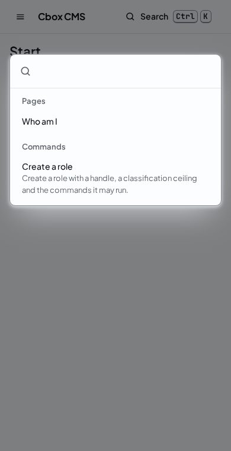

# Command palette

<!-- extension-point: packages/core/resources/schemas/queries/action.list.v1.json -->
<!-- extension-point: packages/core/resources/schemas/queries/action.list.result.v1.json -->

The panel is keyboard first (GUARDRAILS 8): Ctrl+K, or Command+K on a Mac, opens the command palette from every page behind the login, and so does the "Search" button in the shell's top bar. Typing filters its entries, ignoring case and accents; Up and Down move through them while the focus stays in the search field; Enter opens the entry in focus; Escape closes the palette and gives the focus back to where it was. The palette is the kit's `CommandPalette`, the combobox pattern of WAI-ARIA: the search field controls a listbox of options and names the option in focus, the focus stays inside the dialog, and axe finds nothing on it at any width ([the component kit](../../ui/components.md)).




Its entries come from the server, never from a list in the panel's code, so the palette names no action, type or field and offers nothing the server would refuse:

- **Pages**: the navigation entries the person may open, the same entries the shell's navigation shows ([panel shell points](shell.md), [panel pages](pages.md)), each opening its page.
- **Commands**: every command exposed on Inertia whose permission the person holds on some node, labelled by the panel's catalogue when it has a text for the action (`panel.action.<name>.title` and `.description`), and by the title and description of the command's JSON Schema otherwise, found by the command's name too. Choosing one opens the command's form page, `GET <prefix>/commands/<name>/v<version>`, the address the Inertia profile runs the command at ([the panel module](../../developers/panel.md)).

Every page behind the login shares the prop `palette`, the read of `action.list` as the person who signed in, through the query pipeline from the session credential: its result as the result codec wrote it, or the problem details of a rejected read, which the palette shows in place of its entries with what to do. The prop's schema is `palette.v1.json` in `packages/panel/resources/schemas/pages`, with the generated codec `PalettePropCodecV1` and TypeScript `PalettePropV1`, and the panel checks the result with the generated validator of `ActionListV1` before it builds the entries.

## action.list

`action.list` version 1 is the query the palette is built from (PRD 13.2, 13.4), exposed on REST, `GET /v1/queries/action.list/v1`, and in the panel. Its document carries nothing: the actor is never a field of a query, so the pipeline takes it from the credential alone. `ListActions` implements `Cbox\Cms\Contracts\Pipeline\ActorQuery`, so every actor may run it without a permission, because it tells an actor no more than what the actor may do, and the anonymous principal is refused as `unauthorized` ([queries](../queries.md)). The schemas are `action.list.v1.json` and `action.list.result.v1.json` in `packages/core/resources/schemas/queries`, read and written by the generated codecs `ListActionsCodecV1` and `ActionListCodecV1` ([query JSON](../query-json.md)).

Its result, `ActionList`, has two lists:

- `actions`, a `ListedAction` per action of the compiled registry exposed on Inertia that the actor may run, in the registry's order: the `name` and `version` of the command or query it handles, its `kind`, `command` for a write and `query` for a read (`ListedActionKind`), and the `title` and `description` of that contract version's JSON Schema. An action is allowed as the kernel's authorizers allow it on some node: a public query for anyone, an actor query for every actor, and any other action through a role whose permissions name it and that reaches some node in some locale, as the `PermissionRule` decides from the actor's grants, read under the read's actor context. An action exposed on no surface, or not on Inertia, is never listed, nor is one whose contract no codec reads, because no surface can run it.
- `navigation`, a `ListedNavEntry` per `NavContribution` of the panel registry the actor may open, in render order: its `id`, its `label`, a translation key of its addon's catalogue, its `icon` and the `page` it opens. An entry is listed when the activation state leaves it enabled, the actor holds the permission its scope requires, and the actor gets its page: an addon's page that is enabled and whose own permission the actor holds, or one of the panel's own pages. The addresses of the pages are those of the panel's contributions, so a REST client joins the two by the page's id.

The panel and REST stay in parity (decided by Sylvester on 29 September 2026): `packages/http/tests/Rest/ActionListParityTest.php` holds the document a person gets from REST to the prop `palette` of every page behind the login, and `tests/Browser/Panel/PaletteTest.php` opens the palette with the keyboard in Chromium at the widths of a phone, a tablet and a desktop. The example is in the `Unit` suite:

<!-- example: examples/Unit/Panel/CommandPaletteTest.php -->
```php
<?php

declare(strict_types=1);

use Cbox\Cms\Contracts\Identity\ClassificationAccess;
use Cbox\Cms\Contracts\Pipeline\ActorQuery;
use Cbox\Cms\Core\Codecs\Boundary\Generated\ActionListCodecV1;
use Cbox\Cms\Core\Codecs\Boundary\Generated\ListActionsCodecV1;
use Cbox\Cms\Core\Registry\Domain\ActionKind;
use Cbox\Cms\Core\Registry\Domain\Dto\ActionList;
use Cbox\Cms\Core\Registry\Domain\Dto\ListedAction;
use Cbox\Cms\Core\Registry\Domain\Dto\ListedNavEntry;
use Cbox\Cms\Core\Registry\Domain\ListedActionKind;
use Cbox\Cms\Core\Registry\Domain\Queries\ListActions;

// The command palette is built from action.list, a query every actor may run without a permission
// (ActorQuery): the actions of the compiled registry exposed on Inertia whose permission the actor
// holds on some node, each with its kind and the title and description of its JSON Schema, and the
// navigation entries the actor may open. The result is the same document on REST and in the
// panel's prop `palette`, written by the generated codec whatever the reader's classification
// access, because it holds no content: names, kinds and texts of the registry.

const EXAMPLE_LIST = '{"actions":[{"description":"Creates a role (PRD 5.10, 6.4) in one changeset.","kind":"command","name":"role.create","title":"role.create, contract version 1","version":1}],'
    .'"navigation":[{"icon":null,"id":"cms.account-me","label":"panel.nav.account_me","page":"account.me"}]}';

it('lists actions without input, as a query every actor may run', function (): void {
    $query = new ListActionsCodecV1()->decode('{}', ClassificationAccess::Public);

    expect($query)->toBeInstanceOf(ListActions::class)
        ->and($query)->toBeInstanceOf(ActorQuery::class)
        ->and(ListedActionKind::of(ActionKind::Write))->toBe(ListedActionKind::Command)
        ->and(ListedActionKind::of(ActionKind::Query))->toBe(ListedActionKind::Query);
});

it('writes the actions and the navigation entries the same at every access', function (): void {
    $codec = new ActionListCodecV1;
    $list = $codec->decode(EXAMPLE_LIST, ClassificationAccess::Public);

    $action = $list->actions[0] ?? null;
    $entry = $list->navigation[0] ?? null;

    expect($list)->toBeInstanceOf(ActionList::class)
        ->and($action)->toBeInstanceOf(ListedAction::class)
        ->and($action instanceof ListedAction ? $action->name->value : null)->toBe('role.create')
        ->and($action instanceof ListedAction ? $action->kind : null)->toBe(ListedActionKind::Command)
        ->and($entry)->toBeInstanceOf(ListedNavEntry::class)
        ->and($entry instanceof ListedNavEntry ? $entry->page->value : null)->toBe('account.me')
        ->and($codec->encode($list, ClassificationAccess::Public))->toBe(EXAMPLE_LIST)
        ->and($codec->encode($list, ClassificationAccess::Sensitive))->toBe(EXAMPLE_LIST);
});
```
