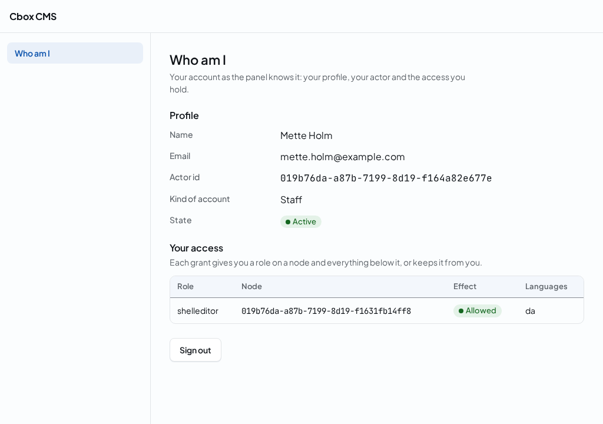
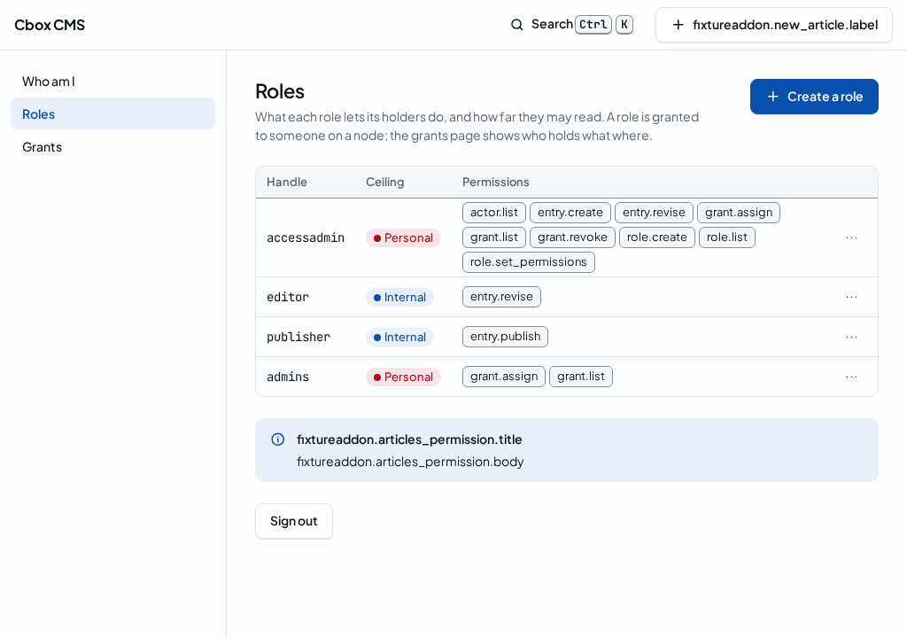
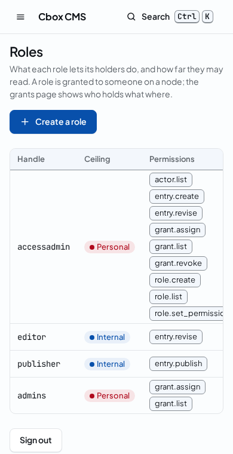
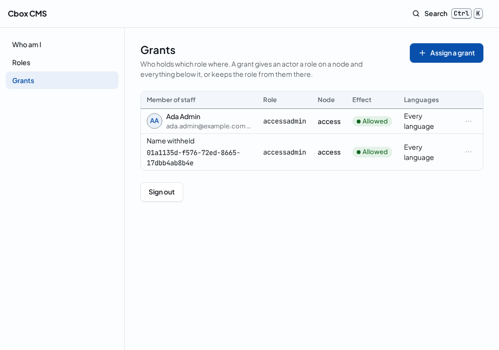
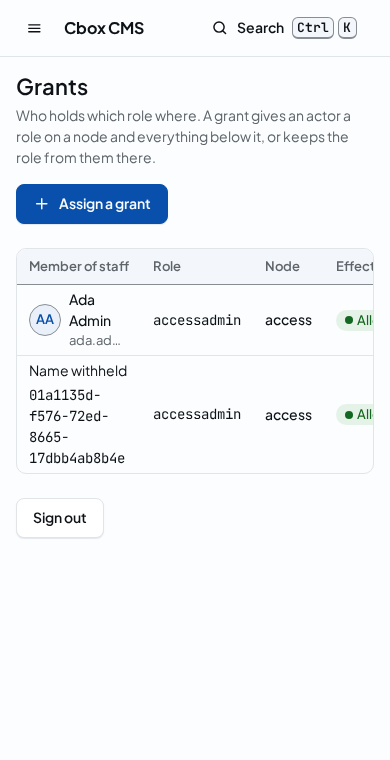
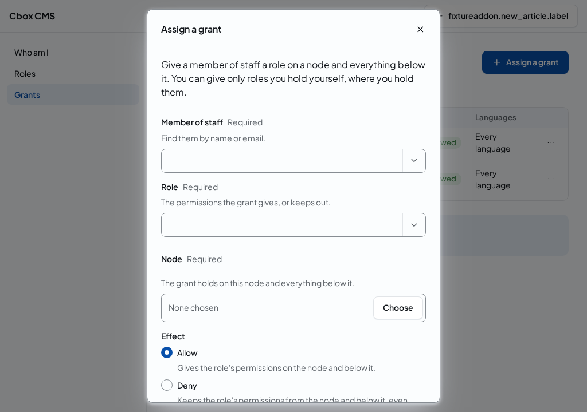

# Panel pages

<!-- extension-point: packages/core/resources/schemas/queries/actor.me.v1.json -->
<!-- extension-point: packages/core/resources/schemas/queries/actor.me.result.v1.json -->

The panel has pages of its own behind the login (PRD 13.4): the start page, the who-am-I page and the roles and grants pages, each at a fixed address below the panel's prefix, and each rendering the [shell's points](shell.md) around its content. A page that reads gets its props from a query of the kernel, run through the query pipeline as the person who signed in, from the session credential, and written by the query's result codec, so what the page shows is what REST answers the same person with. [The panel module](../../developers/panel.md#page-props) lists each page's props schema and generated codec.

| Page | Address | Reads | Points it declares |
|---|---|---|---|
| `home`, the start page | `<prefix>` | nothing | none of its own |
| `account.me`, the who-am-I page | `<prefix>/account/me` | `actor.me` version 1 | [`account.me.sections@1`](points/account-me-sections.md) |
| `command.form`, the generic [command form](command-form.md) | `<prefix>/commands/<name>/v<version>` | nothing; its props are the command's JSON Schema | seven, listed on [the form's points](command-form.md#the-forms-points) |
| `access.roles`, the roles page | `<prefix>/access/roles` | `role.list` version 1 | [`access.roles.sections@1`](points/access-roles-sections.md) |
| `access.grants`, the grants page | `<prefix>/access/grants` | `grant.list` version 1, and `actor.list`, `role.list` and `node.list` version 1 for its pickers | [`access.grants.sections@1`](points/access-grants-sections.md) |
| `login`, the login page, a credential page that runs no addon code | `<prefix>/login` | nothing | [`login.notice@1`](points/login-notice.md) |

## The login page's notices

The login page is a credential page: no addon code runs on it, so the page writes no addon into its import map and loads nothing of an addon (decision D13). An addon shows a notice above the login form with a `LoginNotice`, plain data the page renders itself as the kit's callout, in render order, at [`login.notice@1`](points/login-notice.md). The page's prop `notices` carries them, `#/$defs/notice` of `login.v1.json`, each with its message already in the page's locale: a credential page carries no catalogue, so `cms:build`'s compiled catalogue of the addon is read on the server ([i18n](../../ui/i18n.md#an-addons-texts)), and a key the addon ships no text for travels as the key. The workbench's fixture addon contributes `fixtureaddon.login-notice`.

## Navigation entries and their permissions

A module of `cboxdk/cms` registers a page in the shell's navigation with a `NavContribution` to `shell.nav@1`, declared through its service provider's `DeclaresCoreContributions` in the namespace `cms`, as the core's own contributions are ([panel contributions](contributions.md#the-cores-own-contributions)). The entry names the page it opens, one of the panel's own pages by its id, its label, a translation key of the panel's catalogue, and its icon, and in its `Scope` the permission the viewer must hold, `requires`: the name of a command or read. The server decides per request and viewer: an entry is sent only when the viewer holds its permission on some node, as the `PermissionRule` decides it from the viewer's grants, and an entry whose page is an addon's only when the viewer gets that page. An entry the viewer may not see is never sent, not even its id. The entries are the pages of the [command palette](command-palette.md) too, through `action.list`.

The who-am-I page's entry requires nothing, because every actor reads its own self; the roles page's entry requires `role.list` and the grants page's `grant.list`, the queries the pages read, so a person is offered no page they could not read. The panel renders the entries in render order, the lowest priority first: the core's at 100, 200 and so on, an addon's at 1000 unless its manifest says otherwise. There is no registry besides the contributions: `cms:build` compiles the entries with every other contribution onto `panel.php`, and the installation reorders or disables one as it does an addon's ([order, choices and the kill switch](contributions.md#order-choices-and-the-kill-switch)).

## The who-am-I page

`GET <prefix>/account/me` shows a person their own account: their name and email, their actor id, the kind of account and its state, and the grants they hold, each with its role, the node it holds on, whether it allows or denies, and the languages it holds in. The page reads `actor.me` through the query pipeline as the person, and its props carry the result as the result codec wrote it, or the problem details of a rejected read; the page checks the result with the generated TypeScript validator before it shows it. Below its own sections it hosts `account.me.sections@1`, and it keeps its sign-out in its own content.



The panel and REST stay in parity (decided by Sylvester on 29 September 2026): a panel page that reads is an Inertia query page, and the query it reads must be a query action on REST, so `tests/Feature/Surfaces/SurfaceParityTest.php` fails on a page whose query REST does not expose, and on any action exposed on Inertia alone. In part 1 of B1 a person reaches REST with no credential of their own, so parity on REST is shown with a service actor's Bearer credential; personal API tokens for people come in part 2.

## actor.me

`actor.me` version 1 is the query of one's own self (PRD 5.16, 13.4), exposed on REST, `GET /v1/queries/actor.me/v1`, and in the panel's Inertia pages. Its document carries nothing: the actor is never a field of a query, so the pipeline takes it from the credential alone. Its result is the actor's id, class, state and version, its profile, or null when the actor has none, and the grants it holds that have not ended in the order of their ids, each with its role and the role's handle, its node, its effect, its locales (null for every locale) and its version. The schemas are `actor.me.v1.json` and `actor.me.result.v1.json` in `packages/core/resources/schemas/queries`, read and written by the generated codecs `WhoAmICodecV1` and `ActorMeCodecV1` ([query JSON](../query-json.md)).

Who may run it is the rule of a self-read: `WhoAmI` implements `Cbox\Cms\Contracts\Pipeline\ActorQuery`, the marker of a query every actor may run without a permission, because what it reads is bounded by the actor's own context ([queries](../queries.md)); the anonymous principal is refused as `unauthorized`, and no role names `actor.me`. The result is not content: `ActorMe` does not implement `ReadsContent`, so the pipeline strips nothing and the answer carries no content keys. The profile is the subject's own, so the result's schema classifies neither value: a person always reads their own name and email, whatever their classification access, where the [access queries](../access-queries.md) leave another actor's profile out below personal access. The kernel reads the self through the port `OwnActorReader` under the read's actor context, so a read can give nothing but the reader's own actor, profile and grants.

## The sections of the page

Below its own sections the page hosts [`account.me.sections@1`](points/account-me-sections.md), a slot in its sections region whose props are the viewer's actor id, which a section's data query takes as its input. The profile and the grants are the page's own and are never handed to a section.

## Roles and grants

The roles and grants pages (PRD 5.10) are where an administrator manages access without leaving the panel, in parity with REST: every list is a query of the kernel read as the person, and every change a command through the Inertia profile as the person, the same commands and queries REST exposes ([role commands](../role-commands.md), [grant commands](../grant-commands.md), [access queries](../access-queries.md)). Both pages read a keyset page at a time, after the id the address names as `?after=<id>`, so the address is the state; Next opens the next page's address, Previous goes back through the pages opened. What a person may do on a page comes from `action.list`, the shared prop the [command palette](command-palette.md) is built from too: a button for a command the person may not run is not shown, and the page says who can instead, so a refusal never ends without a way on.

`GET <prefix>/access/roles` lists the roles with their handle, classification ceiling and permissions, read with `role.list`. A person who may run `role.create` creates a role in a form: its handle, its ceiling and its permissions, chosen among the commands and reads the person may run themselves, because the escalation guard lets an actor give only what it holds (invariant 31), plus those the role already has. A person who may run `role.set_permissions` replaces a role's permissions in full from the row's menu; a list equal to the role's is not sent. The page shows the receipt of each change and, for a refusal, the problem details with what the code means in the person's language, at the form while it is open and the field each error is about marked.





`GET <prefix>/access/grants` lists the grants that have not ended on the nodes the person reaches, read with `grant.list`: each with its member of staff, whose name and email the page shows when the person's classification access allows personal and withholds otherwise, its role, the node's path, whether it allows or denies, and the languages it holds in. A person who may run `grant.assign` opens the form to assign one; as it opens, the page asks the server for the optional prop `pickers`, the reads of `actor.list`, `role.list` and `node.list` as the person, and the pickers say what they wait for until they arrive. The member of staff is found by name or email, the role chosen by handle with its permissions shown, the node in the content tree of the nodes the person reaches, the effect allow or deny, and the languages among those the installation's sites publish in (`cbox-cms.sites`), none for every language. A person who may run `grant.revoke` revokes a grant from the row's menu after a confirmation. The receipt and any refusal are shown as on the roles page: a grant of an administrative role is refused with `step_up_required` and one of a role the person does not hold with `grant_escalation_refused`, each explained in the person's language with what to do.







Each page hosts a slot in its sections region without props, [`access.roles.sections@1`](points/access-roles-sections.md) and [`access.grants.sections@1`](points/access-grants-sections.md): the roles and the grants are the page's own, and a section's data query reads what it needs as the viewer.

[Add a panel page](../../recipes/panel-page.md) is the recipe for a page of this kind. The example is in the `Unit` suite:

<!-- example: examples/Unit/Panel/PanelPagesTest.php -->
```php
<?php

declare(strict_types=1);

use Cbox\Cms\Contracts\Identity\ClassificationAccess;
use Cbox\Cms\Contracts\Ids\ActorId;
use Cbox\Cms\Contracts\Ids\CommandName;
use Cbox\Cms\Contracts\PanelPoints\ContributionId;
use Cbox\Cms\Contracts\PanelPoints\NavContribution;
use Cbox\Cms\Contracts\PanelPoints\PointKind;
use Cbox\Cms\Contracts\PanelPoints\Scope;
use Cbox\Cms\Contracts\Pipeline\ActorQuery;
use Cbox\Cms\Core\Codecs\Boundary\Generated\ActorMeCodecV1;
use Cbox\Cms\Core\Codecs\Boundary\Generated\WhoAmICodecV1;
use Cbox\Cms\Core\Identity\Domain\Dto\ActorMe;
use Cbox\Cms\Core\Identity\Domain\Queries\WhoAmI;
use Cbox\Cms\Panel\Account\Domain\Dto\AccountMeSectionsV1;
use Cbox\Cms\Panel\Boundary\Generated\Points\AccountMeSectionsCodecV1;

// A module registers a page in the panel's navigation with a nav entry to shell.nav@1: the entry
// names one of the panel's own pages and, in its scope, the permission the viewer must hold on
// some node to see it; the server decides per viewer. The who-am-I page reads actor.me, a query
// every actor may run without a permission (ActorQuery), whose result carries the subject's own
// profile whatever the reader's classification access, so a person always sees their own name and
// email. The page's sections point hands an addon's section the viewer's actor id and nothing more.

const EXAMPLE_ME = '{"actor":"0199a3c1-2b4d-7e5f-8a6b-1c2d3e4f5a01","class":"staff","grants":[{"effect":"allow","id":"0199a3c1-2b4d-7e5f-8a6b-1c2d3e4f5a03",'
    .'"locales":["da"],"node":"0199a3c1-2b4d-7e5f-8a6b-1c2d3e4f5a04","role":"0199a3c1-2b4d-7e5f-8a6b-1c2d3e4f5a05","role_handle":"desk","version":1}],'
    .'"profile":{"display_name":"Ada Byline","email":"ada@example.com"},"state":"active","version":1}';

it('registers a page in the navigation with the permission its viewer must hold', function (): void {
    $entry = new NavContribution(new ContributionId('cms.grants'), 'shell.nav@1', 'panel.nav.grants', 'access.grants', null, 200, new Scope(requires: new CommandName('grant.list')));

    expect($entry->kind())->toBe(PointKind::Nav)
        ->and($entry->page)->toBe('access.grants')
        ->and($entry->scope->requires?->value)->toBe('grant.list')
        ->and($entry->runsCode())->toBeFalse();
});

it('reads who am I without input, and writes the subject s own profile at every access', function (): void {
    $query = new WhoAmICodecV1()->decode('{}', ClassificationAccess::Public);
    $codec = new ActorMeCodecV1;
    $me = $codec->decode(EXAMPLE_ME, ClassificationAccess::Public);

    expect($query)->toBeInstanceOf(WhoAmI::class)
        ->and($query)->toBeInstanceOf(ActorQuery::class)
        ->and($me)->toBeInstanceOf(ActorMe::class)
        ->and($me->profile?->email->value)->toBe('ada@example.com')
        ->and($codec->encode($me, ClassificationAccess::Public))->toBe(EXAMPLE_ME)
        ->and($codec->encode($me, ClassificationAccess::Sensitive))->toBe(EXAMPLE_ME);
});

it('hands the sections of the who-am-I page the viewer s actor id as their props', function (): void {
    $props = new AccountMeSectionsV1(ActorId::fromString('0199a3c1-2b4d-7e5f-8a6b-1c2d3e4f5a01'));

    expect(new AccountMeSectionsCodecV1()->encode($props, ClassificationAccess::Public))->toBe('{"actor":"0199a3c1-2b4d-7e5f-8a6b-1c2d3e4f5a01"}');
});
```
