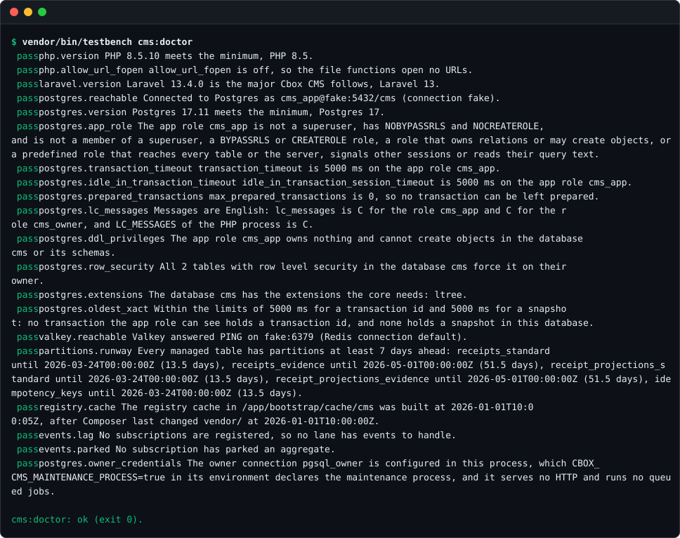
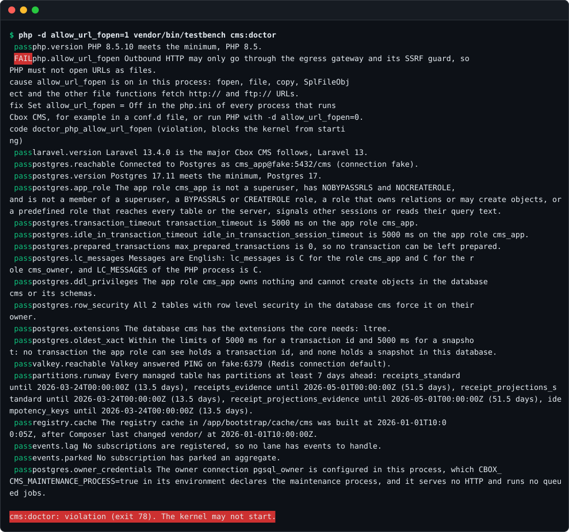

# cms:doctor

<!-- extension-point: packages/contracts/resources/schemas/doctor.v1.json -->

`cms:doctor` checks the installation and the runtime contract (PRD 3.3, 4.2, 13.2). For each part it says whether it is in order, and for each problem what is wrong and how to fix it (GUARDRAILS 7.1). `--dev` adds the development tools, and `--json` prints only a document that a deploy script or a readiness probe reads. The process exits with a fixed code: ok; a violation or a dependency that is unavailable right now, both from a check that blocks the kernel from starting; or not ready, when only checks that affect readiness fail.

This page covers the checks the core runs, the three types of process an installation runs, how the doctor turns the results into an exit code, and the document of `--json`, described by the JSON Schema [`doctor.v1.json`](../../packages/contracts/resources/schemas/doctor.v1.json). How an application or addon adds a check of its own, and how it tests one, is on [Doctor checks](../addons/doctor-checks.md).

In the development environment, run it in the php container, `docker compose exec php vendor/bin/testbench cms:doctor`, after `composer dev:prepare`. Each line names a check, its status and what it looked at:



A failing check says what is wrong, the concrete cause, the fix and its error code, and the last line gives the status and the exit code:



## Which checks run

`cms:doctor` runs the core's own checks, which `CoreServiceProvider` builds, and after them the checks an application or addon adds in `cbox-cms.doctor.checks` and `cbox-cms.doctor.dev_checks` (see [Adding a check](../addons/doctor-checks.md#adding-a-check)).

The core's checks run in this order. The last three run only with `--dev`. A check that is not blocking only affects readiness: the kernel still starts while it fails, and when no blocking check fails the doctor exits 79, not ready.

| Id | Blocking | Requires | What it looks at |
|---|---|---|---|
| `php.version` | yes | | PHP 8.5 or newer |
| `php.allow_url_fopen` | yes | | `allow_url_fopen` is off, so outbound HTTP goes only through the egress gateway |
| `laravel.version` | yes | | Laravel 13 |
| `postgres.reachable` | yes | | Postgres answers on the app role's connection |
| `postgres.version` | yes | `postgres.reachable` | Postgres 17 or newer |
| `postgres.app_role` | yes | `postgres.reachable` | the app role is not a superuser, has NOBYPASSRLS and NOCREATEROLE, and is not a member of a role with more power |
| `postgres.transaction_timeout` | yes | `postgres.version` | `transaction_timeout` is above zero and set on the app role |
| `postgres.idle_in_transaction_timeout` | yes | `postgres.version` | `idle_in_transaction_session_timeout` is above zero and set on the app role |
| `postgres.prepared_transactions` | yes | `postgres.reachable` | `max_prepared_transactions` is 0 |
| `postgres.lc_messages` | yes | `postgres.reachable` | the messages of Postgres and libpq are English |
| `postgres.ddl_privileges` | yes | `postgres.reachable` | the app role owns nothing and cannot create objects |
| `postgres.row_security` | yes | `postgres.reachable` | every table with row level security also forces it |
| `postgres.extensions` | yes | `postgres.reachable` | the extensions the core's tables need, ltree, are installed; the core's migrations create them as the owner role |
| `postgres.oldest_xact` | no | `postgres.reachable` | no transaction has held a transaction id, and no session of this database a snapshot, for longer than 5 s (see [The horizon and the event log](#the-horizon-and-the-event-log)) |
| `valkey.reachable` | yes | | Valkey answers PING |
| `partitions.runway` | no | `postgres.reachable` | every partitioned table has partitions far enough ahead of the clock, or of its sequence for a table with the key `bigint` |
| `registry.cache` | yes | | the registry cache of `cms:build` exists and is not older than `vendor/` |
| `events.lag` | no | `postgres.reachable`, `registry.cache` | no subscription has an unhandled event older than the lag target of its lane |
| `events.parked` | no | `postgres.reachable` | no subscription has parked aggregates |
| `postgres.owner_credentials` | no | | only the maintenance process holds the owner role's credentials |
| `dev.node` | no | | Node on the PATH, at least the configured minimum |
| `dev.playwright` | no | `dev.node` | Playwright is installed in the project |
| `dev.chromium` | no | `dev.playwright` | Playwright's Chromium is downloaded |

The identity module adds four blocking checks in front of the ones an application names in `cbox-cms.doctor.checks`, so they run right after the core's runtime checks (see [Credential store](../security/credential-store.md) and [Sessions](../security/sessions.md)):

| Id | Blocking | Requires | What it looks at |
|---|---|---|---|
| `identity.connection` | yes | `postgres.reachable` | the identity connection answers, and logs in neither as the app role nor as the owner role |
| `identity.credential_isolation` | yes | `postgres.reachable`, `identity.connection` | the schema `cms_identity` exists, the app role has no privilege on it or its tables, and the identity role is not a superuser, has NOBYPASSRLS and NOCREATEROLE, and is not a member of a role with more power |
| `identity.argon2id` | yes | | PHP can hash passwords with Argon2id |
| `identity.session_cookie` | yes | | the session cookie of the environment can be set, and outside local and testing it is Secure, named with the `__Host-` prefix and not SameSite=None |

When the doctor's own settings, `cbox-cms.doctor`, are invalid, or a check added there cannot be used, the doctor runs none of these. It runs the single check `doctor.config` instead, which fails as a violation with the code `doctor_config_invalid` and names the setting in its cause, so the command still prints its document and exits with the violation code.

## Processes: web, queue and maintenance

An installation runs the kernel in three types of process. They run the same code against the same database, but only one of them holds the owner role's credentials (PRD 4.2). The app role on the default connection owns no tables and has no DDL, so code in the web and queue processes, an addon's included, cannot change the schema or pass row level security as the owner of the tables. Run `cms:doctor` in each of them, with that process's configuration.

| Process | What it runs | Its database connections | `CBOX_CMS_MAINTENANCE_PROCESS` in its environment |
|---|---|---|---|
| Web | HTTP requests: PHP-FPM, `php artisan serve` or Octane | the default connection, as the app role | unset |
| Queue | queued jobs: `php artisan queue:work`, `queue:listen` or Horizon | the default connection, as the app role | unset |
| Maintenance | the migrations on the owner connection, `php artisan migrate --database=pgsql_owner`, and the scheduler, `php artisan schedule:work` or `php artisan schedule:run` every minute, which runs `cms:partitions:maintain` every hour | the default connection, and the owner role's connection that `cbox-cms.database.owner_connection` names, `pgsql_owner` by default | `true` |

- **Only the maintenance process has the owner connection.** Leave `database.connections.pgsql_owner` and the owner's password out of the web and queue processes' configuration. They must not share a configuration cache (`php artisan config:cache`) with the maintenance process: build the maintenance process's cache in its own container or release, with the owner connection, and the web and queue processes' cache without it.
- **A web or queue process with the owner connection does not boot.** The core decides from the process itself what it runs, never from the configuration: a process that PHP does not run in the console, or that Octane started (`LARAVEL_OCTANE` in its environment), serves HTTP, and a console process whose command is `queue:work`, `queue:listen`, `horizon`, `horizon:supervisor` or `horizon:work` runs queued jobs. Such a process with the owner connection configured stops while it boots with `OwnerCredentialsExposed` (`[owner_credentials_exposed]`), before it runs a request or a job, so a shared configuration cache that holds the owner's credentials takes the web and queue processes down instead of handing the credentials to their code.
- **The maintenance process declares itself in its environment.** Set `CBOX_CMS_MAINTENANCE_PROCESS=true` in the environment of the maintenance process alone, such as its container definition, never in `.env` or the configuration, which the processes may share. The doctor reads `true` or `1` as declared and `false`, `0` or unset as not; any other value fails `doctor.config`. `postgres.owner_credentials` fails in a console process that has the owner connection unless that variable declares it, so a `cms:doctor` run in the web or queue container, whose configuration was given the owner's credentials by mistake, reports the process as not ready.
- **The maintenance process serves no HTTP and runs no queue worker.** It is a console process, such as a container that runs `php artisan schedule:work` and runs `php artisan migrate --database=pgsql_owner --force` on deploy. The migrations run as the owner role, because the app role cannot create tables. Run one of them; two do no harm, because `cms:partitions:maintain` holds an advisory lock in Postgres for a whole run, so runs never overlap.
- **Only the maintenance process schedules partition maintenance.** The core adds `cms:partitions:maintain` to the schedule only in a process whose configuration has the owner connection, so a scheduler in the web or queue process schedules nothing of the kernel's. Without a maintenance process no new partitions are created: `partitions.runway` fails, in every process, once a partitioned table has partitions for less than `cbox-cms.doctor.partition_runway_days` ahead, or fewer than `cbox-cms.doctor.partition_runway_partitions` empty partitions ahead of its sequence, and a write past the last partition fails with `partition_missing`.

### Postgres messages in English

The kernel recognises some Postgres errors by their text, because the SQLSTATE does not tell them apart, so the messages must be English (PRD 4.2). Setting that up is the operator's job, done once for the database server and its roles; the kernel never changes a role or a server setting itself. `postgres.lc_messages`, which blocks, checks that a new session of the app role and of the owner role gets `lc_messages` `C`, `POSIX`, `C.<charset>` or `en_*`, and that the PHP process's `LC_MESSAGES`, which libpq's own messages follow, is English too. It reads the owner role's setting from the catalog as the app role, so it runs in the web and queue processes without the owner's credentials. As a superuser, run:

- `ALTER SYSTEM SET lc_messages = 'C'` and then `SELECT pg_reload_conf()`, so the errors from before a login are English as well;
- `ALTER ROLE <app role> SET lc_messages = 'C'` and `ALTER ROLE <owner role> SET lc_messages = 'C'`, so a session of either role is English whatever the server's default.

A value set with `ALTER ROLE ... IN DATABASE` wins over both, so reset it there. Start PHP with `LC_ALL` and `LC_MESSAGES` unset, `C` or `en_*`. When the check fails, its fix names the roles and the commands for this installation.

## The horizon and the event log

The event runners read only the events of transactions that have certainly ended, below the transaction horizon (PRD 7.4), so one transaction that stays open delays every subscriber of the installation. Four checks watch this (PRD 7.12, GUARDRAILS 5). Only the first blocks; the other three affect readiness, because the kernel must run for the runners to catch up, and a failure of them makes the doctor exit 79.

- **`postgres.idle_in_transaction_timeout`** checks, like `postgres.transaction_timeout`, that a new session of the app role gets an `idle_in_transaction_session_timeout` above zero from the role itself, so a session that begins a transaction and then waits, for a lost client or a call to another service, is ended by the server. As a superuser, run `ALTER ROLE <app role> SET idle_in_transaction_session_timeout = '5s'`.
- **`postgres.oldest_xact`** gives the two alarms of the horizon (PRD 4.2). It fails with `doctor_horizon_held` when a client backend anywhere on the server has held a transaction id for longer than 5 s, because transaction ids are shared by every database of the server and so is the event horizon; and with `doctor_snapshot_held` when a session of this database has held a snapshot for longer than 5 s, which holds back vacuum. 5 s is the command budget: command transactions are capped there and background work runs in transactions under 2 s, so anything older is outside every budget. The age is the time since the transaction began, `xact_start` in `pg_stat_activity`, an upper bound, because Postgres records neither when it assigned the id nor when it took the snapshot. Postgres shows that time only to members of the session's role, and the app role is a member of no other role, so the check counts and names the sessions of other roles, such as the owner role's migrations, without an age, and they never fail it.
- **`events.lag`** reads, for each subscription the registry cache lists, the first event past its cursor of a type it receives, in the order the runner hands them over, whether or not the event is below the horizon yet. It fails with `doctor_events_lag` when one is older, at the doctor's clock, than the lag target of the subscription's lane (PRD 7.6): 500 ms for `critical`, 60 s for `standard`, 5 min for `external` and 2 s for `revalidate`. The `background` lane is best effort; its lag is listed and never fails the check. The cause names each subscription behind, its lane and target, and the stream, time and age of its oldest unhandled event. Either no runner runs the lane, `php artisan cms:events:run --lane=<lane>`, or a transaction holds the horizon, which `postgres.oldest_xact` names.
- **`events.parked`** fails with `doctor_events_parked` while a subscription has parked aggregates that are not yet released (PRD 7.8), and names the count per subscription. List them with `php artisan cms:events:parked` and release each with `php artisan cms:events:release` once the fault is fixed.

When the event log or the registry cache cannot be read, `events.lag` and `events.parked` fail with `doctor_event_log_unreadable`.

## Skips and crashes

A check never returns a skip. Only the doctor skips a check: when a check it requires did not pass, the doctor does not run it and reports it with the status skip and a cause that names the requirement, such as `postgres.reachable did not pass.`. A skip is not a failure and does not change the exit code; the failure of the requirement already does. A blocking check requires only blocking checks, so a skipped blocking check always comes with a blocking failure, and the kernel never starts without it.

The doctor always gives a complete report and never exits ok for a check that did not look. A check that breaks its contract fails as a `Violation` with the code `doctor_check_crashed`, and its cause says how it broke the contract. The failure keeps the check's blocking: a crashed blocking check makes the doctor exit 78, a crashed check that does not block 79. That covers a `run()` that throws, a result for another id or with another blocking than the check's own, and a skip returned from `run()`. The fix says it is a bug in the check.

## Exit codes: DoctorExitCode

The exit codes of `cms:doctor` are defined in one place, the enum `Cbox\Cms\Contracts\Doctor\DoctorExitCode`. `status()` gives the name the JSON document uses.

| Case | Exit code | `status()` | When |
|---|---|---|---|
| `Ok` | 0 | `ok` | every check passed or was skipped |
| `Unavailable` | 75, `EX_TEMPFAIL` of sysexits.h | `unavailable` | at least one blocking check failed as `Unavailable`, and no blocking check as `Violation` |
| `Violation` | 78, `EX_CONFIG` of sysexits.h | `violation` | at least one blocking check failed as `Violation` |
| `NotReady` | 79 | `not_ready` | no blocking check failed, and at least one check that does not block failed, as either kind |

When a blocking check fails, the blocking failures alone decide the code, and a violation wins over an unavailable dependency, because waiting does not fix it. The failures of checks that do not block count only when no blocking check fails: then the doctor exits 79. The document lists every failure, blocking or not. `DoctorExitCode::for($results)` adds up a list of `CheckResult`s this way. The values come from the error catalog's `ExitCode`, and each code a check fails with has its entry in the [error reference](../reference/errors.md).

A readiness probe or a deploy guard can rely on the exit code alone: the kernel may start at 0 and 79, which `allowsStart()` says, and it is ready only at 0. 79 lies just above the range of sysexits.h, 64 to 78, so it has no other meaning there, and it cannot be mistaken for 1, a general error, or 2, wrong usage.

This example adds up the results of the testkit's `FakeDoctorCheck`, which passes or fails as the test says; the fake is described on [Doctor checks](../addons/doctor-checks.md#testing-a-check-doctorcheckcontract-and-fakedoctorcheck). It is in the `Unit` suite:

<!-- example: examples/Unit/Doctor/ExitCodeTest.php -->
```php
<?php

declare(strict_types=1);

use Cbox\Cms\Contracts\Doctor\CheckId;
use Cbox\Cms\Contracts\Doctor\DoctorExitCode;
use Cbox\Cms\Contracts\Doctor\FailureKind;
use Cbox\Cms\Testkit\Doctor\FakeDoctorCheck;

// How cms:doctor adds up its exit code from the results of its checks, with the testkit's
// FakeDoctorCheck standing in for real checks: the blocking failures decide the code, a violation
// wins over an unavailable dependency, and a failure of a check that does not block the kernel
// from starting gives 79 only when no blocking check fails.

it('exits ok when every check passes', function (): void {
    $results = [
        FakeDoctorCheck::passing(new CheckId('example.first'))->run(),
        FakeDoctorCheck::passing(new CheckId('example.second'), blocking: false)->run(),
    ];

    expect(DoctorExitCode::for($results))->toBe(DoctorExitCode::Ok)
        ->and(DoctorExitCode::Ok->value)->toBe(0)
        ->and(DoctorExitCode::Ok->status())->toBe('ok')
        ->and(DoctorExitCode::Ok->allowsStart())->toBeTrue();
});

it('exits unavailable when a blocking check cannot reach a dependency, whatever fails that does not block', function (): void {
    $results = [
        FakeDoctorCheck::failing(new CheckId('example.database'), FailureKind::Unavailable)->run(),
        FakeDoctorCheck::failing(new CheckId('example.workers'), FailureKind::Violation, blocking: false)->run(),
    ];

    expect(DoctorExitCode::for($results))->toBe(DoctorExitCode::Unavailable)
        ->and(DoctorExitCode::Unavailable->value)->toBe(75)
        ->and(DoctorExitCode::Unavailable->status())->toBe('unavailable')
        ->and(DoctorExitCode::Unavailable->allowsStart())->toBeFalse();
});

it('exits violation when a blocking check is violated, whatever else is unavailable', function (): void {
    $results = [
        FakeDoctorCheck::failing(new CheckId('example.database'), FailureKind::Unavailable)->run(),
        FakeDoctorCheck::failing(new CheckId('example.setting'), FailureKind::Violation)->run(),
        FakeDoctorCheck::failing(new CheckId('example.cache'), FailureKind::Unavailable, blocking: false)->run(),
    ];

    expect(DoctorExitCode::for($results))->toBe(DoctorExitCode::Violation)
        ->and(DoctorExitCode::Violation->value)->toBe(78)
        ->and(DoctorExitCode::Violation->status())->toBe('violation')
        ->and(DoctorExitCode::Violation->allowsStart())->toBeFalse();
});

it('exits not ready when only checks that do not block fail, so the kernel may start but is not ready', function (): void {
    $results = [
        FakeDoctorCheck::passing(new CheckId('example.first'))->run(),
        FakeDoctorCheck::failing(new CheckId('example.workers'), FailureKind::Violation, blocking: false)->run(),
        FakeDoctorCheck::failing(new CheckId('example.cache'), FailureKind::Unavailable, blocking: false)->run(),
    ];

    expect(DoctorExitCode::for($results))->toBe(DoctorExitCode::NotReady)
        ->and(DoctorExitCode::NotReady->value)->toBe(79)
        ->and(DoctorExitCode::NotReady->status())->toBe('not_ready')
        ->and(DoctorExitCode::NotReady->allowsStart())->toBeTrue();
});

it('lets a test repair or break a fake check between runs, and counts the runs', function (): void {
    $check = FakeDoctorCheck::failing(new CheckId('example.setting'));

    expect($check->run()->code)->toBe(FakeDoctorCheck::CODE);

    $check->passes();

    expect($check->run()->passed())->toBeTrue()
        ->and($check->runs())->toBe(2);
});
```

## The document of cms:doctor --json

`cms:doctor --json` prints one JSON document and nothing else, and exits with the code the document names. The JSON Schema [`doctor.v1.json`](../../packages/contracts/resources/schemas/doctor.v1.json) (draft 2020-12) describes it; an installed application finds it at `vendor/cboxdk/cms/packages/contracts/resources/schemas/doctor.v1.json`. Every key is always present, a value that does not apply is `null`, and the keys are sorted. The schema allows no other keys. A change that is not backwards compatible gets a new schema file.

The document has five keys:

| Key | Type | Meaning |
|---|---|---|
| `checks` | array of check objects, at least one | the checks in the order they ran |
| `dev` | boolean | whether the development checks of `--dev` ran |
| `exit_code` | integer, 0 to 255 | the exit code of the process, the value of `DoctorExitCode` |
| `status` | `ok`, `violation`, `unavailable` or `not_ready` | the name of the exit code, `DoctorExitCode::status()` |
| `version` | the number `1` | the version of the document |

Each check object has eight keys:

| Key | Type | Meaning |
|---|---|---|
| `blocking` | boolean | whether the kernel refuses to start while this check fails |
| `cause` | text or `null` | for a failure, the concrete cause; for a skip, the requirement that did not pass; otherwise `null` |
| `code` | error code or `null` | for a failure, the error code, lowercase snake_case with at least two words and at most 63 characters; otherwise `null` |
| `explanation` | text | what the check looked at and what it found, in plain words |
| `failure` | `violation`, `unavailable` or `null` | for a failure, its `FailureKind`; otherwise `null` |
| `fix` | text or `null` | for a failure, how to fix it; otherwise `null` |
| `id` | check id | the stable id of the check, such as `postgres.reachable` |
| `status` | `pass`, `fail` or `skip` | the outcome; skip when a check it requires did not pass |

Text is a string with at least one character that is not white space. The schema also holds the values to each other:

- A check with the status `pass` has `null` for `failure`, `code`, `cause` and `fix`.
- A check with the status `fail` has a `failure`, and text for `code`, `cause` and `fix`.
- A check with the status `skip` has text for `cause`, and `null` for `failure`, `code` and `fix`.
- The status `ok` has the exit code 0, and no check has a `failure`.
- The status `violation` has an exit code of at least 1, and at least one blocking check failed as `violation`.
- The status `unavailable` has an exit code of at least 1, at least one blocking check failed as `unavailable`, and no blocking check failed as `violation`.
- The status `not_ready` has an exit code of at least 1, at least one check that does not block failed, and no blocking check failed.

This example runs the public command through Artisan against the services of the test environment, with and without `--dev`, validates the document with opis/json-schema and checks that `exit_code` is the command's exit code. It asserts no particular status, because that depends on the host running it, for example on `allow_url_fopen` in its php.ini. It is in the `Postgres` suite, which needs `composer services:up`:

<!-- example: examples/Postgres/Doctor/DoctorJsonTest.php -->
```php
<?php

declare(strict_types=1);

use Cbox\Cms\Contracts\Doctor\DoctorExitCode;
use Composer\InstalledVersions;
use Illuminate\Support\Facades\Artisan;
use Opis\JsonSchema\CompliantValidator;
use Opis\JsonSchema\Errors\ErrorFormatter;
use Opis\JsonSchema\Errors\ValidationError;

// Runs cms:doctor --json against the services of the test environment and validates what it prints
// against doctor.v1.json from the installed cboxdk/cms, found through Composer. Decode the document
// without the associative flag, so that a JSON object stays an object for the validator. The test
// asserts no particular status: that depends on the host, for example on allow_url_fopen in its
// php.ini.

it('prints a document that doctor.v1.json accepts, and exits with its exit_code', function (array $options, bool $dev): void {
    $schema = file_get_contents(InstalledVersions::getInstallPath('cboxdk/cms').'/packages/contracts/resources/schemas/doctor.v1.json')
        ?: throw new RuntimeException('Cannot read doctor.v1.json.');

    $exitCode = Artisan::call('cms:doctor', ['--json' => true, ...$options]);
    $document = json_decode(Artisan::output(), false, 512, JSON_THROW_ON_ERROR);

    if (! $document instanceof stdClass) {
        throw new UnexpectedValueException('cms:doctor --json printed no JSON object.');
    }

    $error = new CompliantValidator()->validate($document, $schema)->error();

    expect($error instanceof ValidationError ? new ErrorFormatter()->format($error) : [])->toBe([])
        ->and($document->exit_code)->toBe($exitCode)
        ->and($document->status)->toBe(DoctorExitCode::from($exitCode)->status())
        ->and($document->dev)->toBe($dev);
})->with([
    'the runtime checks' => [[], false],
    'with the development checks of --dev' => [['--dev' => true], true],
]);
```
