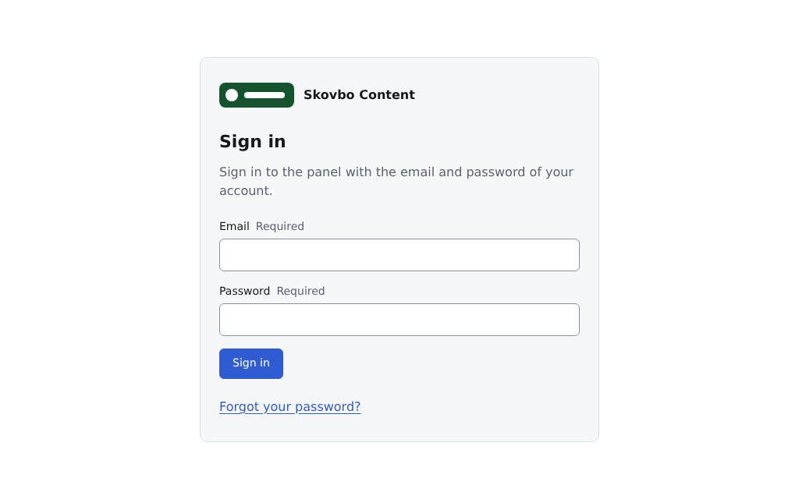
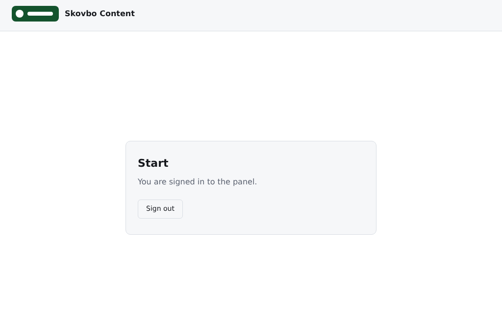

# Branding and theming the panel

An installation makes the panel its own in two parts:

- **Branding** is the installation's identity: the product name, a logo for the light and the dark mode with its alternative text, the login page's image and the favicon, in `cbox-cms.panel.branding`. Only the application sets it. No theme and no addon can change it.
- **Themes** are data: values for the kit's design tokens, such as the accent colour, the radii and the font family, in JSON files. The application selects and orders them in `cbox-cms.panel.themes`, its own theme `app` and those of the addons it allows.

Together they give a white-label panel without building the panel again.

## Branding

`cbox-cms.panel.branding` has five keys, each `null` by default:

| Key | What it is |
|---|---|
| `name` | The product name, 1 to 60 characters without control characters. The shell's header, the login page and every document title show it. Without it the panel shows Cbox CMS. |
| `logo` | The logo of the shell's header: `['light' => <file>, 'dark' => <file>, 'alt' => <text>]`. The alternative text, 1 to 150 characters, is what a screen reader announces. |
| `login` | The image of the login page and the password pages, of the logo's form. Without it they show the logo. |
| `favicon` | The favicon, one file. |
| `root` | The directory every file lies inside, the application's base path when null. |

A file is a path relative to `root`, or an absolute path inside it. It must be a readable SVG or PNG of at most 512 KiB, judged by its bytes, not by its name. The panel refuses an SVG that holds a script, an event handler attribute or a `foreignObject`, because it serves the files from its own origin.

The panel reads the files once per process and serves each at `<prefix>/brand/<role>-<hash>.<svg|png>`, such as `/cms/brand/logo-light-3f9a0c21d4e7b8a6.svg`. The hash is the first 16 hex digits of the file's SHA-256, so a changed file gets a new address, and the response is cached for a year with `nosniff`. A brand file has its own Content-Security-Policy, `default-src 'none'; sandbox`, so an SVG opened on its own runs nothing. The pages load the files as images from the panel's origin, which their policy allows already.

Every page shares the brand as the prop `brand` (`brand.v1.json`, see [the panel module](panel.md#page-props)). The kit's `Brand` component shows the logo of the colour mode the page is in, so a screen reader announces one alternative text, and the product name beside it. The root view writes the name into the document's first title and, when the installation sets one, into an `application-name` meta element, which the panel's script reads for every later title. It also writes the favicon's link.

The workbench's `tests/Browser/Panel/BrandingTest.php` shows all of it in Chromium against the files in `workbench/resources/brand`: the name, the light and the dark logo with its alternative text, the favicon and the title, on the login page and in the shell, with no axe finding; and Cbox CMS without branding.

### When the branding cannot be used

A branding that breaks a rule above is no branding: the panel shows Cbox CMS, and `cms:doctor`'s check `panel.branding` fails with [`doctor_panel_branding_invalid`](../reference/errors.md#doctor_panel_branding_invalid), naming every key that is wrong. The check does not block the kernel from starting, so the doctor exits 79, not ready, until the branding is corrected.

## Themes

A theme is a JSON file of token values, of the form of `js/ui-kit/src/generated/theme.v1.json`, which `npm run generate:tokens` writes from the kit's token catalogue:

- `tokens` sets semantic and component tokens of [the design tokens](../ui/tokens.md) on the whole panel, by name without `--cms-`, such as `color-accent` or `radius-md`; never a primitive `ref-*` token.
- `parts` sets tokens on a curated part hook only, such as `task-screen`.
- Each value is a literal of its token's type: one string for both modes, or an object with exactly `light` and `dark`. A theme that sets one mode sets the other.

A theme has nothing else, so it cannot set a name, a logo or a favicon, and an addon's theme never changes the installation's branding.

The application selects its themes in `cbox-cms.panel.themes`, in the order they compose, a later theme's value over an earlier one's: `app` is the application's own theme in `cbox-cms.panel.app_theme`, and `<namespace>:<name>` is a theme an allowed addon ships. An addon ships a theme in its manifest's `PanelContributions::$themes` by a local name, and needs the capability `AddonCapabilities::$uiTheme`. A theme the selection does not name is never read and has no effect: the workbench's fixture addon ships `fixtureaddon:brand`, a magenta accent, and `tests/Browser/Panel/PanelThemeTest.php` shows that the panel keeps its own tokens until the selection names it.

`cms:build` reads the selected themes, composes them and checks the result:

- every contrast pair of the catalogue must keep WCAG 2.2 AA after composition, in both modes, on the whole panel and on each part hook a theme names: 4.5:1 for text, 3:1 for a user interface part and the focus ring. A pair below fails the build with [`registry_panel_theme_contrast`](../reference/errors.md#registry_panel_theme_contrast), naming the pair, the mode and the place, so two themes that pass alone can still fail together;
- `--cms-target-size` must stay at least 24 pixels;
- everything else it cannot use fails with [`registry_panel_theme_invalid`](../reference/errors.md#registry_panel_theme_invalid): a theme selected twice, an addon that is not allowed or ships no such theme, `app` without its file, an addon theme without `uiTheme`, and a file that is not of the theme's form;
- a token that more than one selected theme sets in one place is a warning, `registry_panel_theme_overlap`, and the last theme wins.

It then writes the stylesheet of the composition next to the registry, `bootstrap/cache/cms/theme.css`, all of it in the cascade layer `cms.theme`, the last of the panel's layers. The panel serves it from its own origin at `<prefix>/theme/<version>.css`, with the version the first 16 hex digits of its SHA-256, and links it on every page with the response's nonce. With no theme selected there is no file and no link.

`cms:panel:theme:check <theme>` runs the same checks on one theme file on its own, with the exit code of the first problem's catalog entry, 65, or 0 when it passes.
