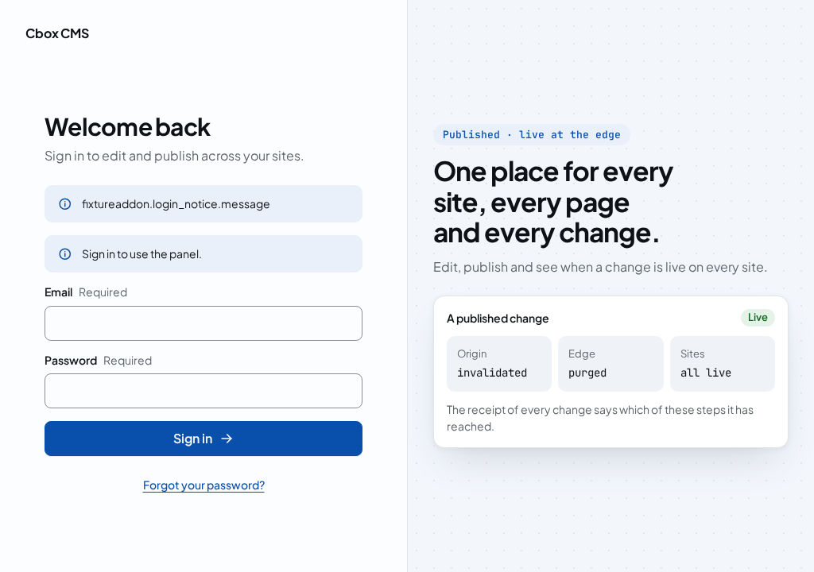
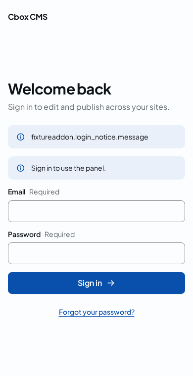
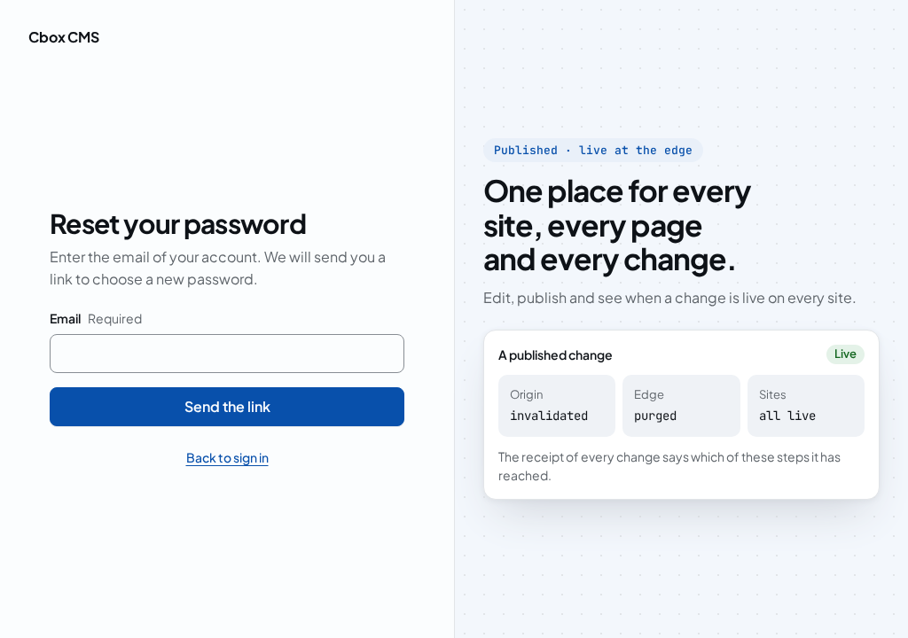
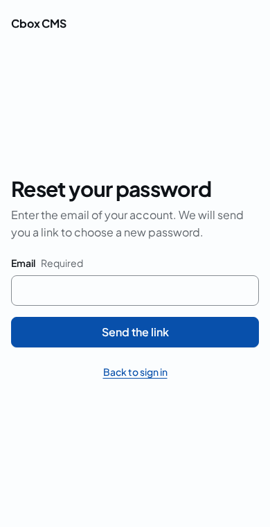
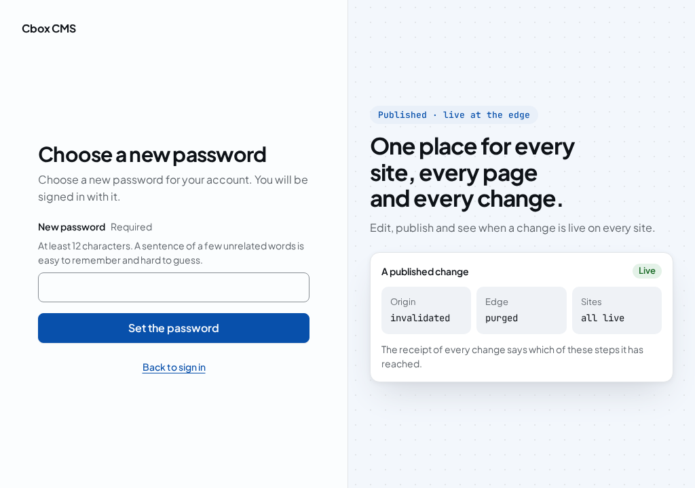
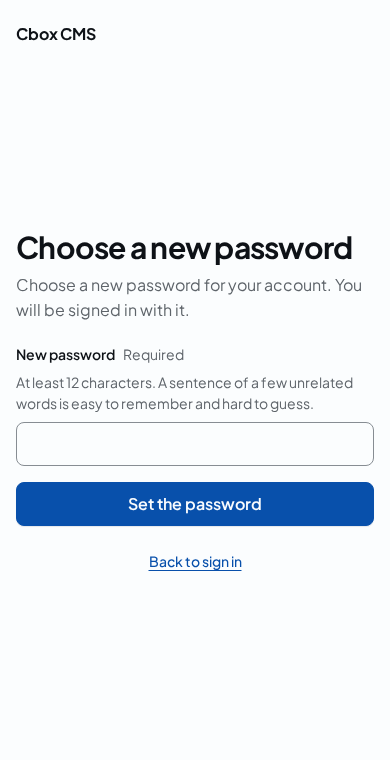
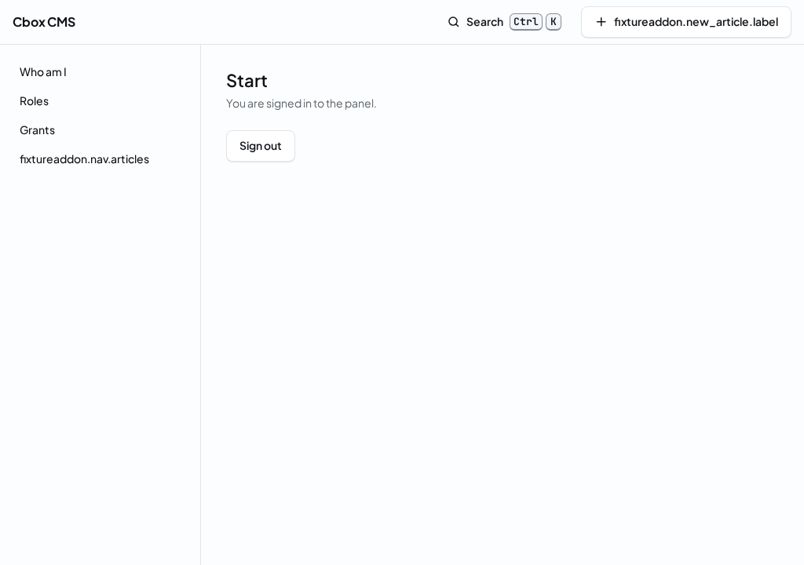
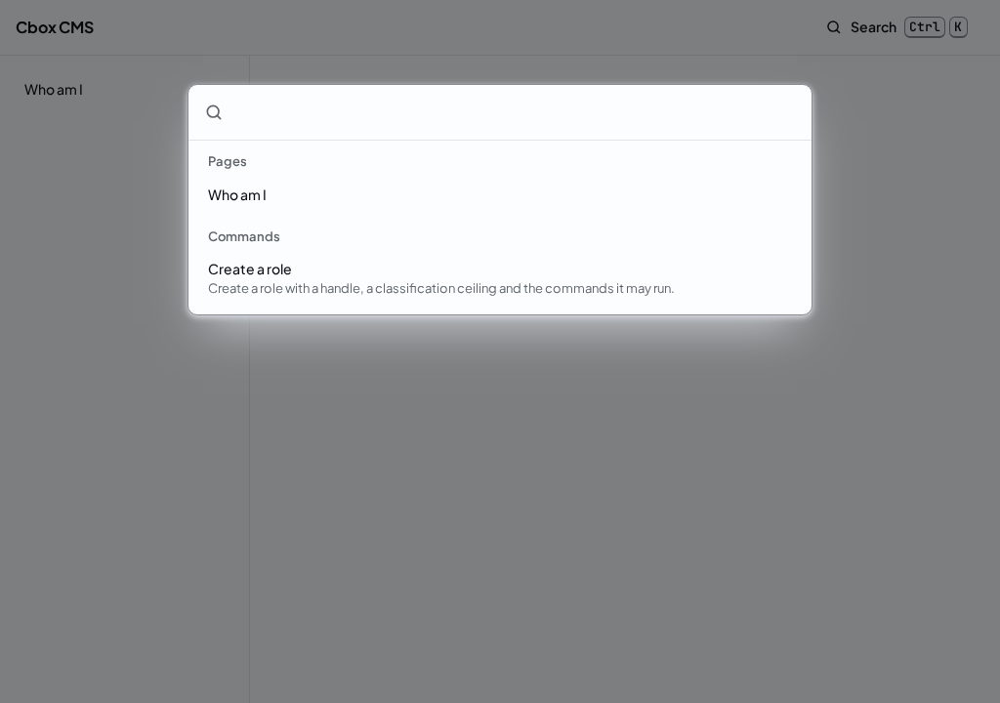

# Signing in

You sign in to the panel at `/cms` of your installation with the email address and the password of your account. Whoever looks after the installation creates the account and gives you access; you cannot sign yourself up.

## Signing in

Open the panel. When you are not signed in, it shows the login page, with a notice above the form that says why you are there: you need to sign in, your session has ended, or you have signed out. Type your email and your password and press Enter, or choose Sign in.

When the email or the password is wrong, the page says so in one message and keeps the email, and never tells whether the email has an account. After too many attempts it asks you to wait a few minutes. The page works the same on a phone:

On the workbench a member of staff signs in with a password alone. Outside the local and testing environments, a member of staff must sign in with a passkey or two factors (PRD 5.16), which the panel does not offer yet.

## A forgotten password

Choose "Forgot your password?" on the login page, type your email and ask for a link. The panel sends a link to that address when it has an account, and says the same whether it has one or not. The link works for 60 minutes, and once.

The link opens a page where you choose a new password, and you are signed in with it. A password has at least 12 characters and must not be known from data breaches; a sentence of a few unrelated words is easy to remember and hard to guess. The new password ends the sessions you had on other devices.

A link that no longer works says so and offers a new one. When no mail reaches you, whoever looks after the installation can print a link for you and hand it over another way; the workbench sends no mail at all, so there that is the way.

## Staying signed in, and signing out

A session of a member of staff ends after 60 minutes without a request and at the latest 12 hours after you signed in; the installation can choose other times. The panel then shows the login page with the reason, and you sign in again. Your sessions also end when your account is deactivated or your password is reset.

Sign out with the Sign out button on the start page and the other pages. The panel ends your session on the server, not only in the browser, and shows the login page.

## Finding your way

After you sign in you land on the start page. The navigation lists the pages your access lets you open: the who-am-I page, with your name, email and the grants you hold, and the roles and grants pages when you may change access. On a phone the navigation folds away behind the menu button.

The command palette finds every page and command you may use. Press Ctrl+K, or Command+K on a Mac, from any page, or choose Search at the top. Type a few letters of a page or a command, move with the arrow keys, and press Enter to open it; Escape closes the palette. A command opens its form, which says what each field means and can show what a run would change before it changes anything.

Every page works with the keyboard alone and shows where the focus is, and its tests check it against WCAG 2.2 AA.
